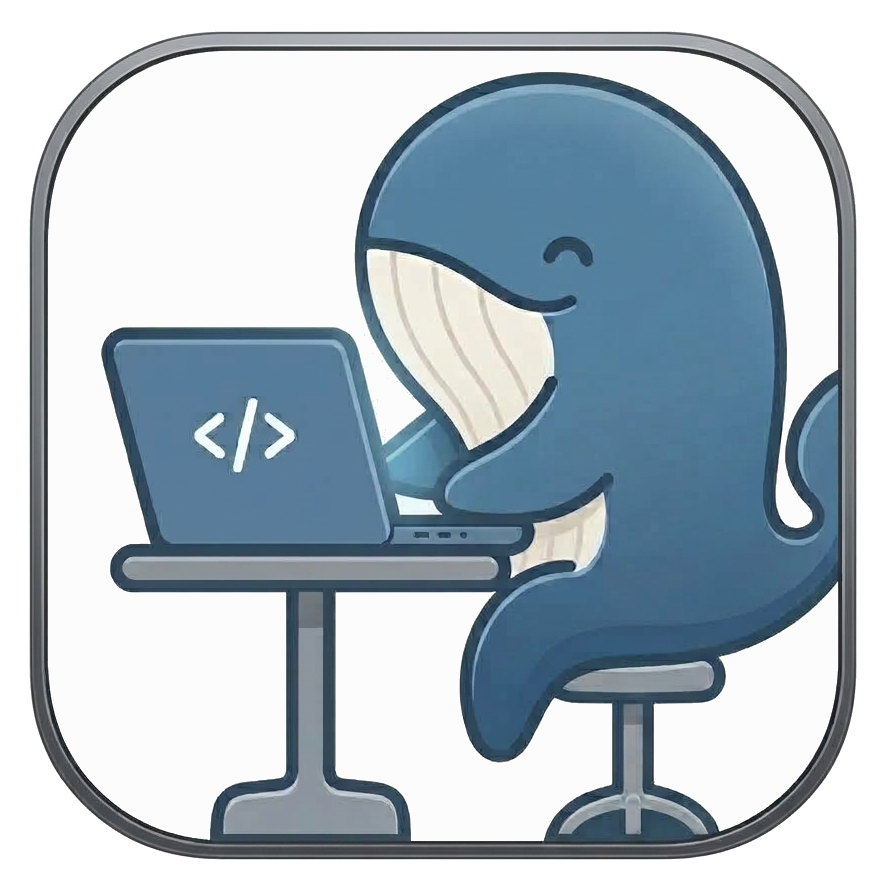
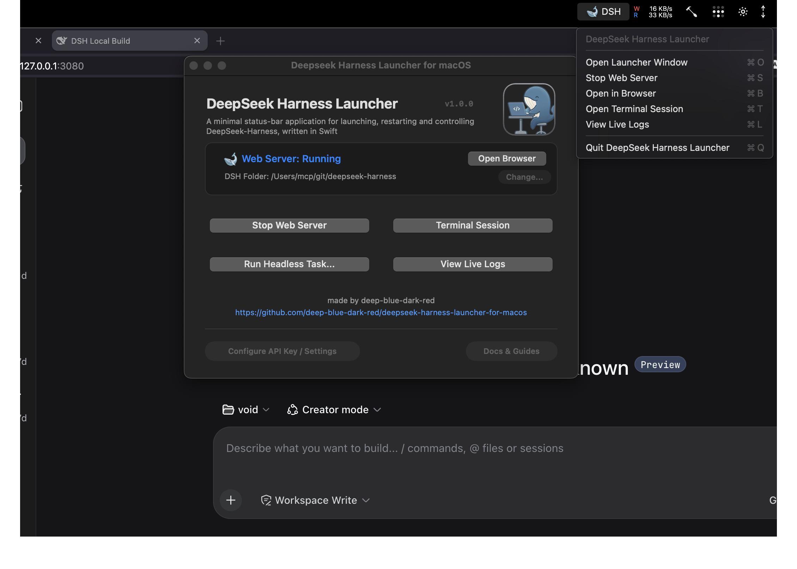
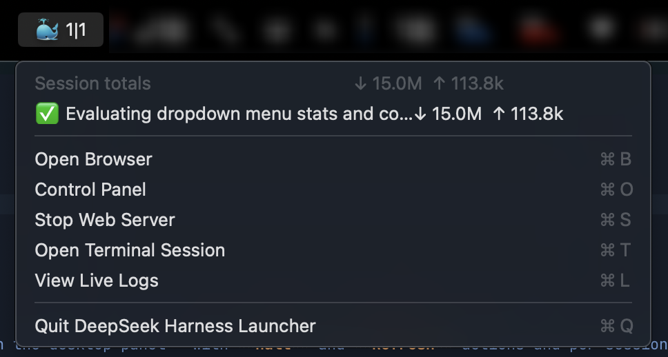

<div align="center">



# DeepSeek Harness Launcher for macOS

**A lean appkit process controller for the [DeepSeek Harness](https://github.com/deepseek-ai/deepseek-harness) server, living in the menu-bar. Live task states, token usage, and process-management, written in Swift.**

[](https://github.com/deep-blue-dark-red/deepseek-harness-launcher-for-macos/releases/latest)
[](https://apple.com/macos)
[](https://swift.org)
[]()
[](https://opensource.org/licenses/MIT)

<br />



</div>

---

## Install

```bash
git clone https://github.com/deep-blue-dark-red/deepseek-harness-launcher-for-macos
cd deepseek-harness-launcher-for-macos
./install.sh
```

Launch via Spotlight (`Cmd + Space`), Finder/Launchpad (`~/Applications/DeepSeek Harness Launcher.app`), or Terminal: `open -a "DeepSeek Harness Launcher"`.

## Update

```bash
git pull    # or check out a release tag
./install.sh
```

## Uninstall

```bash
./uninstall.sh
```

---

## Overview

A lightweight native AppKit app that launches, controls, and monitors DeepSeek Harness servers, web UI, interactive terminal sessions, and headless tasks from the macOS menu bar. The DSH server process is a managed child process of DSHL, which acts as a process watchdog. Quitting DSHL gracefully shuts down the DSH process.

---

## Features

- **Menu Bar & Status Item**: badge shows `🐳` (idle), `🐡` (starting), `🦑` (server stopped), and `<completed>|<total>` while tasks run — e.g. `🐋 0|1` (one running), `🐳 3|3` (all done); additionally `🐳 3|3 🐡 1` means 3 tasks completed, 1 halted (error or user input required). 
- **Menu Bar Task Dropdown**: every session with task name and status; click a task to open it in the web UI; per-task and session-total token usage (`↓ in  ↑ out`).
  
- **Control Window**: server state and server process actions, configuration and job history.
- **Interactive Terminal Session**: native terminal window pre-configured with workspace paths and `$PATH`.
- **Headless Task Launcher**: ad-hoc AI tasks via `dsh --profile headless "<task>"` with a native prompt dialog.
- **Live Log Viewer**: real-time streaming server logs plus history; copy, clear, or open the log file.
- **Environment Discovery**: finds `node` (>= 22.19.0) and `pnpm` across Homebrew, `nvm`, `asdf`, `proto`, `fnm`, and `volta`, preserving your login shell's `$PATH` precedence.
- **Handles No Secrets**: never reads, stores, or forwards your API key. DeepSeek Harness owns its write-only credential store (`$DSH_HOME/.credentials.yaml`, managed from the **Providers** page in the web UI) and also honours an ambient `DEEPSEEK_API_KEY`.
- **Managed Server Lifecycle**: the server runs as a managed child process; quitting the launcher tears it down cleanly. No terminal window is ever started (but you can stream output via *View Live Logs*). Session states are preserved on teardown and resumed on restart.
- **Zero Telemetry**: no analytics, telemetry, or third-party network calls. **Strong recommendation:  audit harnesses/plugin source-code with your agent of choice**. 

---

## Repository Structure

```
deepseek-harness-launcher-for-macos/
├── install.sh                  # End-to-end installation script
├── uninstall.sh                # Clean uninstallation script
├── Info.plist                  # macOS Application bundle metadata & permissions
├── Makefile                    # Make targets (build, install, uninstall, clean)
├── dsh-launcher.command        # Double-clickable macOS Finder script
├── resources/
│   ├── AppIcon.icns            # Multi-resolution Retina icon bundle
│   ├── desktop-macos.png       # Desktop UI screenshot
│   ├── menu-bar-detail.png     # Menu bar dropdown screenshot
│   ├── whale-harness.png       # Logo artwork
│   └── favicon.svg             # Vector icon asset
├── src/
│   └── main.swift              # Native Swift AppKit Launcher implementation
└── scripts/
    ├── build.sh                # Compiles Swift source and bundles the .app
    ├── generate-icon.sh        # Generates soft-corner squircle .icns from artwork
    └── install.sh              # Bundle installer helper
```

---

## Build Targets

```bash
make install     # Build and install to ~/Applications/DeepSeek Harness Launcher.app
make uninstall   # Stop running instances and remove application
make build       # Compile and bundle dist/DeepSeek Harness Launcher.app
make run         # Build and launch application immediately
make icon        # Regenerate AppIcon.icns from resources/whale-harness.png
make clean       # Remove build outputs and cached artifacts
```

---

## System Requirements

- **OS**: macOS 13.0 (Ventura) or newer.
- **Architectures**: Apple Silicon (`arm64`) and Intel (`x86_64`) — `scripts/build.sh` produces a universal binary.
- **Dependencies**: none at runtime (pure native Swift/AppKit). To build from source: Xcode Command Line Tools (`swiftc` via `xcode-select --install`) and `make`.
- **Target Workload**: a local clone of [DeepSeek Harness](https://github.com/deepseek-ai/deepseek-harness).

---

## License

Distributed under the MIT License.
